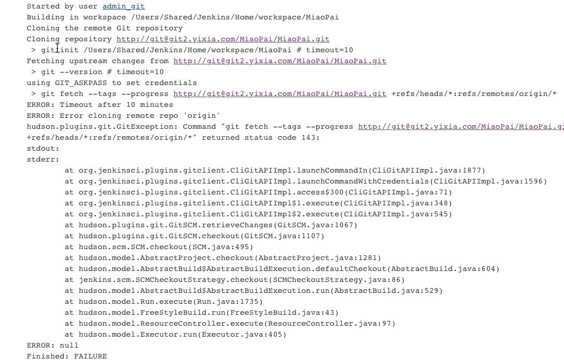
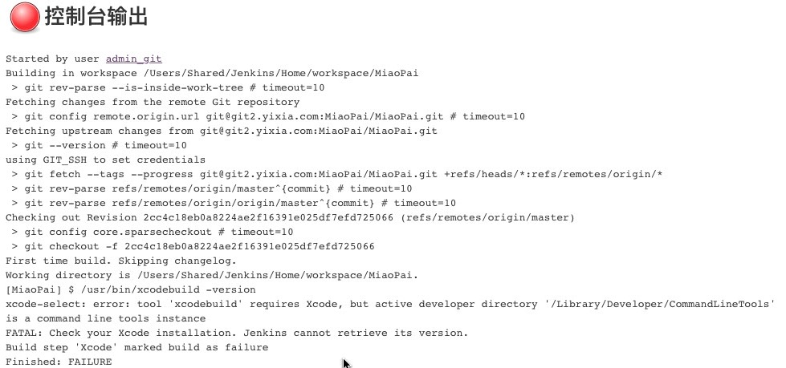
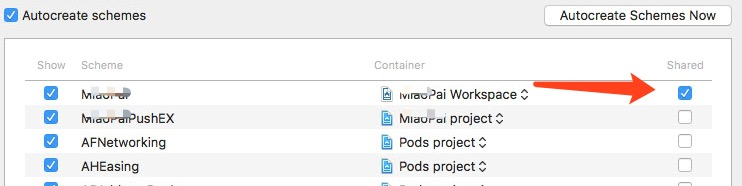
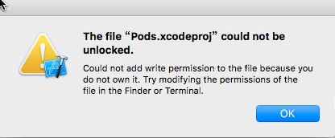
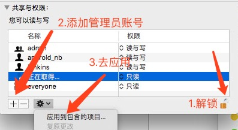

### 在此过程可能出现的问题
---
#####⚠️问题一：
```
Started by user admin_git
Building in workspace /Users/Shared/Jenkins/Home/workspace/MiaoPai
Cloning the remote Git repository
Cloning repository http://git@git2.yixia.com/MiaoPai/MiaoPai.git
 > git init /Users/Shared/Jenkins/Home/workspace/MiaoPai # timeout=10
Fetching upstream changes from http://git@git2.yixia.com/MiaoPai/MiaoPai.git
 > git --version # timeout=10
using GIT_ASKPASS to set credentials 
 > git fetch --tags --progress http://git@git2.yixia.com/MiaoPaiERROR: Error cloning remote repo 'origin'
hudson.plugins.git.GitException: Command "git fetch --tags --progress http://g**.com/**/**.git +refs/heads/*:refs/remotes/origin/*" returned status code 143:
stdout: 
stderr: 
	at hudson.model.FreeStyleBuild.run(FreeStyleBuild.java:43)
	at hudson.model.ResourceController.execute(ResourceController.java:97)
	at hudson.model.Executor.run(Executor.java:405)
ERROR: null
Finished: FAILURE

```  


☁️分析:
```这里主要是git地址的不匹配导致,
如果sshkey配置的是哪个账号就用那个，
也可以用http/https name&password```
 
🌲解决：

```python
# 如果不存在自己创建一个（在你用户管理员的目录下 /Users/ios/）
mkdir .ssh && chmod 700 .ssh 

# 创建公钥私钥copy到粘贴板`pbcopy < id_rsa.pub`传到git服务器上
ssh-keygen -t rsa -C "***@yixia.com"
# 如果已经存在想要备份
mv id_rsa id_rsa_bak
mv id_rsa.pub id_rsa_bak.pub

# 私钥传到jenkins>Credentials上 ,公钥传git服务器
pbcopy < id_rsa

# 然后查看是否配置成功（git服务器地址,git地址用户名可以是指定的 ）
ssh -T git@git.yixia.com
# (返回Welcome to Git!证明添加成功)
 
```

---
#####⚠️问题二：
```
Started by user admin_git
Building in workspace /Users/Shared/Jenkins/Home/workspace/MiaoPai
 > git rev-parse --is-inside-work-tree # timeout=10
Fetching changes from the remote Git repository
 > git config remote.origin.url git@git2.yixia.com:MiaoPai/MiaoPai.git # timeout=10
Fetching upstream changes from git@git2.yixia.com:MiaoPai/MiaoPai.git
 > git --version # timeout=10
using GIT_SSH to set credentials 
 > git fetch --tags --progress git@git2.yixia.com:MiaoPai/MiaoPai.git +refs/heads/*:refs/remotes/origin/*
 > git rev-parse refs/remotes/origin/master^{commit} # timeout=10
 > git rev-parse refs/remotes/origin/origin/master^{commit} # timeout=10
Checking out Revision 2cc4c18eb0a8224ae2f16391e025df7efd725066 (refs/remotes/origin/master)
 > git config core.sparsecheckout # timeout=10
 > git checkout -f 2cc4c18eb0a8224ae2f16391e025df7efd725066
First time build. Skipping changelog.
Working directory is /Users/Shared/Jenkins/Home/workspace/MiaoPai.
[MiaoPai] $ /usr/bin/xcodebuild -version
xcode-select: error: tool 'xcodebuild' requires Xcode, but active developer directory '/Library/Developer/CommandLineTools' is a command line tools instance
FATAL: Check your Xcode installation. Jenkins cannot retrieve its version.
Build step 'Xcode' marked build as failure
Finished: FAILURE
```


☁️分析:
```
xcode路径不对，切换正确路径（如果有多个xcode版本）
```

🌲解决：

```
# 切换指定的xcode路径(路径对照下自己的xcode路径)
sudo xcode-select --switch /Applications/Xcode.app/Contents/Developer/

xcodebuild -showsdks

# 然后就可以交叉编译下
xcrun --sdk iphoneos --show-sdk-path
```

---
#####⚠️问题三：
在执行pod 命令时，提示pod command not found，这个要在shell第一行加上 #bin/bash -l 就ok！

```
/Users/Shared/Jenkins/tmp/jenkins7573461670962290418.sh: 
line 2: pod: command not found
```

🌲解决：

```
#!/bin/bash -l
export LANG=en_US.UTF-8
pod install --verbose --no-repo-update
```
---
#####⚠️问题四：(如果问题三没解决 pod command not found)
如果要降低pod版本

```
#查看gem
gem list

#查看cocoapods版本
gem list --local | grep cocoapods

#卸载当前版本  去掉sudo
sudo gem uninstall cocoapods

#指定pods版本
sudo gem install cocoapods -v 0.95.0

```
---
#####⚠️问题五：(如果问题三&四没解决 pod command not found)
🌲解决：`/usr/local/bin/pod update`

---

#####⚠️问题六：
```
Going to invoke xcodebuild:, scheme: MiaoPai, 
sdk: DEFAULT, workspace: MiaoPai, configuration: Debug, 
clean: YES, archive:NO, symRoot: DEFAULT, configurationBuildDir: /Users/Shared/Jenkins/Home/workspace/MiaoPai/build/output/, codeSignIdentity: DEFAULT
[MiaoPai] $ /usr/bin/xcodebuild -scheme MiaoPai -workspace MiaoPai.xcworkspace -configuration Debug clean build CONFIGURATION_BUILD_DIR=/Users/Shared/Jenkins/Home/workspace/MiaoPai/build/output/
Build settings from command line:
    CONFIGURATION_BUILD_DIR = /Users/Shared/Jenkins/Home/workspace/MiaoPai/build/output/

xcodebuild: error: The workspace named "MiaoPai" does not contain a scheme named "MiaoPai". The "-list" option can be used to find the names of the schemes in the workspace.
Build step 'Xcode' marked build as failure
Finished: FAILURE
```
🌲解决：
Xcode -> Manage Schemes 勾选Shared


然后cd projectFold去执行看看是否有schemes

```
#Debug the issue like this:
xcodebuild -list

#or if you are using a workspace (e.g. with pods)
xcodebuild -workspace ***.xcworkspace -list
```

⚠️如果在这个过程中可能遇到The file "Pods.xcodeproj" could not be unlocked. 具体看问题七

---
#####⚠️问题七：


```
▸ Errno::EACCES - Permission denied 
- /Users/Shared/Jenkins/Home/workspace/MiaoPai/Pods/Pods.xcodeproj/project.pbxproj

Could not add write permission to the file because you do not own it. 
Try modifying the permissions 
```

🌲解决：这个主要是权限问题(特别注意是xcode账号下的用户账号)（记得最后在锁上,重启xcode）


---
#####⚠️问题八：

```
cctwiesgzuocwsfmiwpyhetheunn/Build/Intermediates/Pods.build/Release-iphoneos/AHEasing.build/Objects-normal/armv7/easing.dia -c
 /Users/Shared/Jenkins/Home/workspace/MiaoPai/Pods/AHEasing/AHEasing/easing.c -o 
 /Users/Shared/Jenkins/Library/Developer/Xcode/DerivedData/MiaoPai-cctwiesgzuocwsfmiwpyhetheunn/Build/Intermediates/Pods.build/Release-iphoneos/AHEasing.build/Objects-normal/armv7/easing.o
 
** BUILD FAILED **

The following build commands failed:
	Check dependencies
(1 failure)
Build step 'Xcode' marked build as failure
Finished: FAILURE

```
☁️分析: 发现Frameworks下面.a 找不到


🌲解决：

----
#####⚠️问题九：
执行`sudo gem install fastlane`时报错

```
ERROR:  While executing gem ... (Errno::EPERM)
    Operation not permitted - /usr/bin/bundle
localhost:temp ios$  gem install fastlane
```
🌲解决：
#####一.更新Ruby版本，安转rvm
 `curl -L get.rvm.io | bash -s stable`
######(如有问题请参考问题十)
#####二.检查是否安转成功 
`rvm -v`
######(如有问题请参考问题十一)
#####三.列出已知ruby版本
`rvm list known`
#####四.安转指定或者最新的ruby版本
`rvm install ruby-2.4`
######(如有问题请参考问题十二)

----

#####⚠️问题十：
更新Ruby版本，安转rvm `curl -L get.rvm.io | bash -s stable`

出现下面这个错误 

```
* WARNING: You have '~/.profile' file, you might want to load it,
    to do that add the following line to '/Users/ios/.bash_profile':

      source ~/.profile
```
🌲解决：
修改则需要添加在终端中添加下面语句，再回车
执行下面命令（把"source ~/.profile" 添加到~/.bash_profile）

`echo "source ~/.profile" >> ~/.bash_profile`

---
#####⚠️问题十一：
执行`rmv -v` 提示找不到
`rvm: command not found`

🌲解决：

```
source ~/.rvm/scripts/rvm
# 接着输入
type rvm | head -n 1

```

如果输出的是`rvm is a function`然后指定下面命令添加到bash_profile文件中

`echo "source ~/.rvm/scripts/rvm" >> ~/.bash_profile`

---
#####⚠️问题十二：

安转指定或者最新的ruby版本`rvm install ruby-2.4`出现的问题 

```
Searching for binary rubies, this might take some time.
No binary rubies available for: osx/10.12/x86_64/ruby-2.4.0.
Continuing with compilation. Please read 'rvm help mount' to get more information on binary rubies.
Checking requirements for osx.
Installing requirements for osx.
Updating system...........
Error running 'requirements_osx_brew_update_system ruby-2.4.0',
showing last 15 lines of /Users/ios/.rvm/log/1495002352_ruby-2.4.0/update_system.log
    https://github.com/Homebrew/homebrew/wiki/Common-Issues
and make sure `brew update` works before continuing.'
++ rvm_pretty_print stderr
++ case "${rvm_pretty_print_flag:=auto}" in
++ case "${TERM:-dumb}" in
++ case "$1" in
++ [[ -t 2 ]]
++ return 1
++ printf %b 'Failed to update Homebrew, follow instructions here:
    https://github.com/Homebrew/homebrew/wiki/Common-Issues
and make sure `brew update` works before continuing.\n'
Failed to update Homebrew, follow instructions here:
    https://github.com/Homebrew/homebrew/wiki/Common-Issues
and make sure `brew update` works before continuing.
++ return 1
Requirements installation failed with status: 1.
```
🌲解决：
安转homebrew (<https://brew.sh/index_zh-cn.html>)
`/usr/bin/ruby -e "$(curl -fsSL https://raw.githubusercontent.com/Homebrew/install/master/install)"
`
如果出现`Permission denied`

```
# 目录归属管理
sudo chgrp -R admin /usr/local
# 管理可读
sudo chmod -R g+w /usr/local
```
---
#####⚠️问题十三:
安转brew另外可能出现的问题：：

```
/usr/local/bin/brew: line 28:
/usr/local/Library/brew.rb: Permission denied
/usr/local/bin/brew: line 28: 
exec: /usr/local/Library/brew.rb: cannot execute: Undefined error: 0
```
🌲解决：

```
cd /usr/local
sudo git fetch origin
sudo git reset --hard origin/master
```
然后update

```
brew link `brew list`
brew update && brew upgrade
```
然后可以清理无用的包 
`brew cleanup`

---
#####⚠️问题十四:
```
[MiaoPai] $ /bin/bash -l /Users/Shared/Jenkins/tmp/jenkins4107725767420227826.sh
/Users/Shared/Jenkins/tmp/jenkins4107725767420227826.sh: line 5: 
/Users/Shared/Jenkins/.bash_profile: No such file or directory
cp: /Users/ios/Desktop/fastlane: Permission denied
/Users/Shared/Jenkins/tmp/jenkins4107725767420227826.sh: line 9: fastlane: command not found
Build step 'Execute shell' marked build as failure
Archiving artifacts
Finished: FAILURE
```

☁️分析：由于用ios管理员账号创建的账号，创建了`.bash_profile`和`.profile` 和`.rvm` 它们的路径是在`/Users/ios/`下的。默认创建的jenkins是在`/Users/Shared/`下这里没有`.bash_profile`和`.profile` 和`.rvm`,解决办法copy？ 不要这样做，或者需要特定的需要也可以，推荐的版本就是下面的路径指定

🌲解决：

```
# 在/Users/ios/账号下查看.bash_profile
cat .bash_profile
# copy .bash_profile(cd /Users/ios/ 或者自己的指定路径)
pbcopy < .bash_profile
# 修改.bash_profile中的(cd /Users/Shared/Jenkins下)
sudo vim .bash_profile
# 把2个路径给改成ios下的路径
source /Users/ios/.profile
source /Users/ios/.rvm/scripts/rvm
# 然后ESC :wq  保存退出就好

# fastlane: command not found 看下路径在哪里
which fastlane 

```

---
#####⚠️问题十五:

```
▸ Building MiaoPai/MiaoPaiPushEX [Release]
▸ Check Dependencies
▸ ❌  Code signing is required for product type 'App Extension' in SDK 'iOS 10.3'
Exit status: 65
 📋  For a more detailed error log, check the full log at:
 📋  /Users/Shared/Jenkins/Library/Logs/gym/MiaoPai-MiaoPai.log
 +------+-------------------------------------+-------------+
|                     fastlane summary                     |
+------+-------------------------------------+-------------+
| Step | Action                              | Time (in s) |
+------+-------------------------------------+-------------+
| 1    | Verifying required fastlane version | 0           |
| 2    | default_platform                    | 0           |
| 3    | cocoapods                           | 8           |
| 💥   | gym                                 | 24          |
+------+-------------------------------------+-------------+

 fastlane finished with errors

[!] Error building the application - see the log above
```
🌲解决：

```
1. Targets > PushEX > Build Settings > Architectures > Build Active Architecture Only 设NO
2. Targets > Project > Build Settings > Architectures > Build Active Architecture Only 设NO
3. Targets > Pods > Build Settings > Architectures > Build Active Architecture Only 设NO
4. 如果没解决看看Code Signing Identity
```
---
#####⚠️问题十六:

```
▸ no rule to process file '/Users/Shared/Jenkins/Home/workspace/MiaoPai/MiaoPai/MPTPods/MPTConfig/Pod/Classes/patch/PATCH_README.md' 
of type net.daringfireball.markdown for architecture armv7
```

🌲解决：
在`build phases—>compile sources` 将对应的文件删除


---

####参考：
<http://stackoverflow.com/questions/33521526/the-project-named-foo-does-not-contain-a-scheme-named-bar-bitrise-io>

   